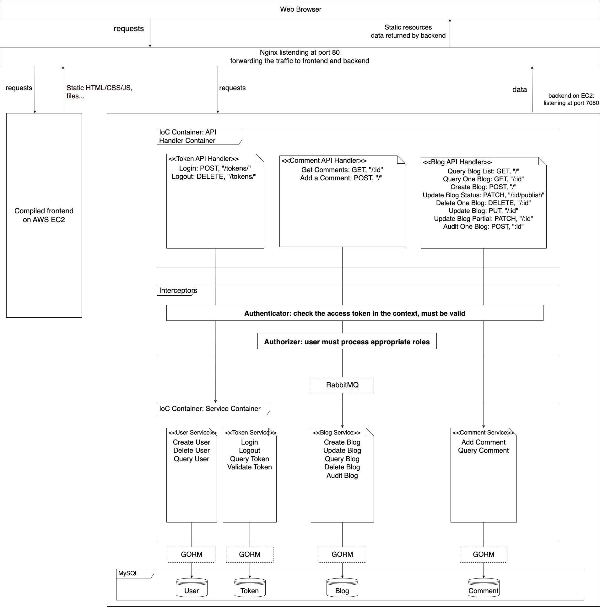

# MyBlog: A MARKDOWN Blog App with a Monolithic Architecture Built with Go

## Language/Framework/Tools/IDE
+ Deployment: `Docker`, `Docker Compose`, `AWS EC2`, `Nginx`
+ Language: `Go 1.22.3 darwin/amd64`
+ Backend Framework: `Gin v1.10.0`
+ Frontend Framework: `Vue`
+ Tools/Middlewares/Libraries:
  + `RabbitMQ`: for decoupling the service layer and api handler
  + `Go Testing`: for unit tests
  + `GORM`: ORM library for dealing with databases
  + `xid`: for token generation
  + `bcrypt`: for password hashing
+ IDE: `VSCode`

## Architecture

## Hightlights in this Project
+ Deployed the App on **AWS EC2** instance with **Docker**, used Docker Compose for orchestration
+ Applied **RabbitMQ** to decouple the API handler and service layer
+ Implemented **TDD** (Test Driven Development) approach and comprehensively performed unit tests for each functionality, improved the robustness of the app
+ Designed **IoC (Inverse of Control) container** to seperate the dependencies between service modules, enhanced scalibility
